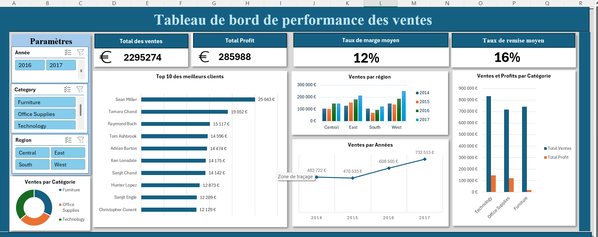

# 📊 Analyse des performances commerciales – Tableau de bord Excel

Ce projet présente un **tableau de bord interactif** réalisé sous **Microsoft Excel**, permettant à une entreprise de **suivre ses performances commerciales** par année, région, catégorie de produits et client.

---

## 🎯 Problématique métier

L’entreprise souhaite **identifier les leviers de croissance** en analysant :

- Les **ventes par segment** (région, produit, année)
- Les **zones peu rentables**
- Les **meilleurs clients**
- L’impact des **remises sur la marge**

---

## 💼 Objectif

Concevoir un tableau de bord **intuitif et dynamique** permettant aux décideurs de :

- Suivre l’évolution du chiffre d’affaires
- Comparer les performances par catégorie
- Visualiser les remises moyennes
- Cibler les segments à améliorer

---

## 📈 Indicateurs clés (KPI)

| Indicateur              | Rôle analytique                                |
|-------------------------|------------------------------------------------|
| **Total des ventes**     | Volume global d'activité                       |
| **Profit total**         | Rentabilité nette                             |
| **Taux de marge moyen**  | Qualité des ventes par rapport aux coûts       |
| **Taux de remise moyen** | Suivi des efforts promotionnels                |
| **Top 10 clients**       | Contribution des clients stratégiques         |

---

## 🧠 Interprétations et recommandations

### ✅ Forces
- **Technology** et **Office Supplies** : marges > 17 %  
- **Croissance continue** des ventes sur 4 ans

### 🚨 À surveiller
- **Furniture** : représente 32 % des ventes mais seulement 6 % du profit  
  → **Marge très faible : 2,5 %**

### 🔎 Recommandations
- Réduire les **remises** sur les produits à faible marge  
- Renforcer les campagnes sur les catégories les plus rentables  
- Creuser les performances par **région** et **sous-catégorie**

---

## 🧹 Transformations effectuées

- Nettoyage dans **Power Query**
- Suppression des colonnes inutiles (IDs)
- Formatage des dates → extraction des **années**
- Ajout de calculs (taux de marge, total profit…)
- Construction de TCD et segments dynamiques

---

## 🖼️ Aperçu du tableau de bord

Voici un aperçu visuel du fichier Excel interactif :

## 🎥 Vidéo de démonstration

Cliquez ci-dessous pour voir le tableau de bord en action :  
[▶️ Voir la vidéo](demo_tableau_de_bord_superstore.mp4)

---

## 👩🏽 Réalisé par

**Aissata BALDE**  
🎓 Master 2 – Behavioral Economics
📬 aichabalde926@gmail.com

